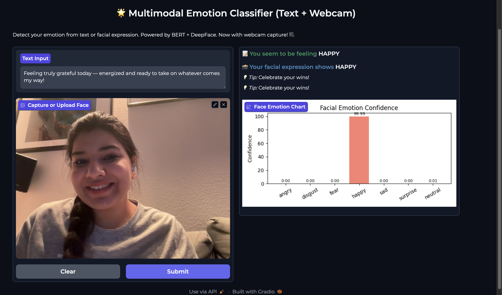

---
# 🎭 Multimodal Emotion Classifier (Text + Face)

This app detects emotions from both:
- 📝 Text using a fine-tuned BERT model
- 😃 Facial expressions using DeepFace

---

## 🌐 Try it Live  
👉 [Launch on Hugging Face Spaces](https://huggingface.co/spaces/sshweta13/Multimodal_Emotion_Classifier)

---

## 🧪 How to Run Locally

1. Place your `BERT_ft_epoch1.model` in this folder  
2. (Optional) Create and activate a virtual environment  
3. Install dependencies:

```bash
pip install -r requirements.txt
```

4. Run the app:

```
python app.py
```

Then open the link shown in terminal (usually http://127.0.0.1:7860)

You can type a message **and** use your webcam for a combined emotion prediction!

## Features
- Dual-mode emotion detection: text + facial expression
- Simple Gradio interface
- Fine-tuned BERT model for text
- DeepFace for facial emotion recognition
- WebCam support in-browser


## Requirements

Listed in `requirements.txt`:
- Gradio 4.44.1  
- Transformers  
- DeepFace  
- TensorFlow 2.12.0  
- Torch  
- OpenCV  
- tf-keras

## 📸 Screenshot



**Live Demo Example:**  
The app successfully identifies both text sentiment and facial emotion.  
In this example:
- **Text input**: “Feeling truly grateful today — energized and ready to take on whatever comes my way!”
- **Facial expression**: Detected as **Happy** with 99.99% confidence.
- The app provides contextual tips:  
  💡 *“Celebrate your wins!”*

🔍 This showcases the app’s ability to process **natural language** and **visual emotion cues** together for a more accurate and human-centric mood analysis.

✨ Built using **BERT**, **DeepFace**, and **Gradio**, the app is mobile-ready and designed for real-time interaction.


## Future Plans
- iOS app with camera integration  
- Cloud API for mobile use  
- Mood-based tips & affirmations  
- Emotion history tracking (opt-in)